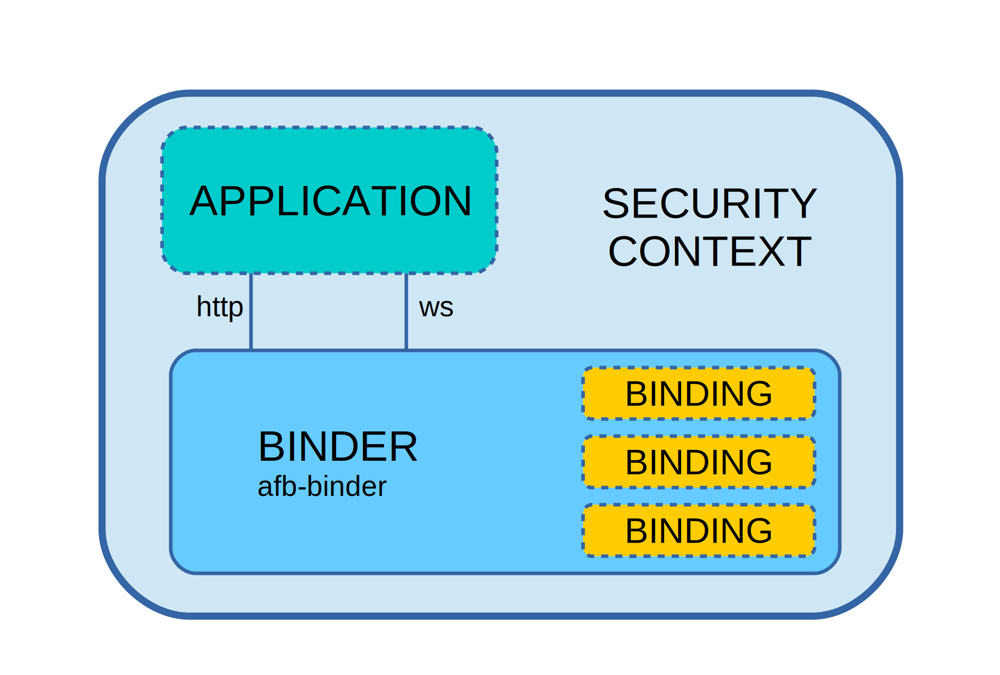
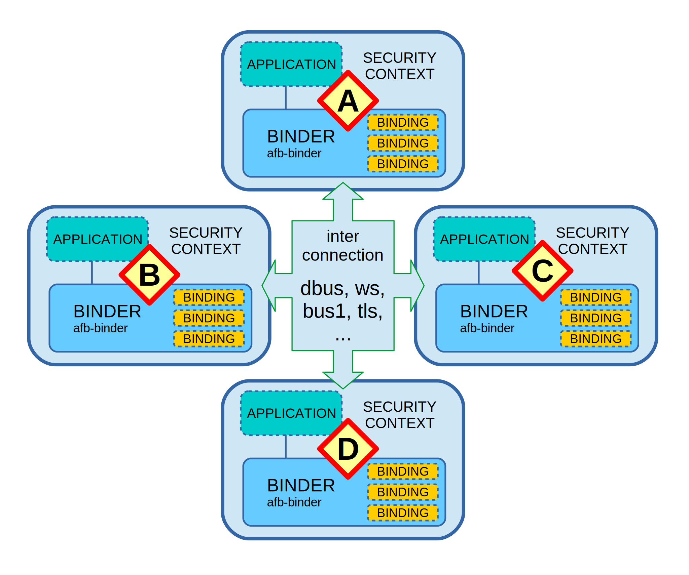

# Binder Overview

The ***binder*** provides the way to connect applications to
the services that it needs.

It provides a fast way to securely offer APIs to applications
written in any language and running almost anywhere.

- The ***binder*** is developed for redpesk and AGL (Automotive Grade Linux)
  but it is not bound to them.
- The ***binder*** is the usual name.
- The binary is named **afb-binder**.
- The name **afb-binder** stands for ***Application Framework Binder***.

Each ***binder*** is in charge to bind one instance of  an application or
service to the rest of the system, applications and services.

Within Redpesk, the connection between services and applications 
is automatically set up by the
[application framework](),
using the binder.

## The basis of the binder

The following figure shows main concepts linked to the ***binder***.

The shown elements are:

- The SECURITY CONTEXT

  The primary intention of any ***binder*** is to provide
  a secured environment for any application.  
  On redpesk, the **security context** is ensured by [Smack],
  the security context of the application or service.

- The BINDER

  This is the central element.  
  It makes possible to run HTML5 applications and provides 
  the unified access to APIs provided by the ***bindings***.

  Running a pure HTML5 application doesn't require any ***binding***.  
  In that case , the ***binder*** acts as a simple HTTP server for
  the web runtime.

- The BINDINGs

  A ***binding*** adds one **API** to the ***binder***.

  An **API** is a set of **verbs** that can be called
  using either REST over HTTP or a kind of JSON RPC.

  ***bindings*** are either:

  - dynamically loaded libraries in the ***binder*** process
  - remote service running on the same host
  - remote service running on other hosts

  When acting as an HTTP server, the binder treats the language
  settings of the HTTP requests to provide internationalized
  content as specified by
  [widget specifications](https://www.w3.org/TR/widgets/#internationalization-and-localization).
- The APPLICATION

  An ***application*** connects to the binder to get access to
  the **API** that it provides or to get its HTTP services to access
  resources.

<!-- pagebreak -->

## Interconnection of binders

The AGL framework interprets the **widget/application** manifests
to setup the ***bindings*** configuration of the ***binders***.

The figure below shows that ***binders*** are interconnected.

The figure shows 4 several **application/service**: **A**, **B**,
**C** and **D**.

The application **A** might use an **API** that is shown as a
local ***binding*** but that in reality runs within the context
of **D**.

The [application framework]()
of Redpesk takes care of making the plumbing working.

## Role of binders in micro service architecture

Inside the redpesk micro-service architecture, the binder is used for
two main purposes, either together or separately:

1. Entry point of user applications for using micro-services
2. Interconnection of services together

The interconnection of services together

## Bindings

The bindings are dynamically loaded libraries that bring callable
APIs to the binder. The API brought by bindings can be exported
to other bindings 
